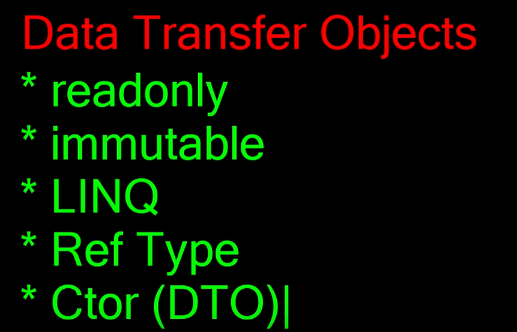

Merhaba bu repoda Asp .Net Core 6 web api projeleri oluşturacağım ve aşamalarını sizlerle paylaşacağım 👩🏻‍💻

# 📁 [hello_world_api_cli](https://github.com/gulsunciftci/AspDotNetCoreWebApi/tree/main/AspDotNetCoreWebApi/hello_world_api_cli)

* Bu proje'yi  UI aracını kullanarak oluşturdum. Peki UI nedir?
### UI: 
* Bir arayüz(user interface) aracılığı ile proje oluşturma şansı tanır.

# 📁 [hello_world_api_ui](https://github.com/gulsunciftci/AspDotNetCoreWebApi/tree/main/AspDotNetCoreWebApi/hello_world_api_ui)

* Bu projeyi komut seti yardımıyla oluşturdum. Peki CLI nedir?
### CLI:
* [Microsoft .Net Basic Commands ](https://learn.microsoft.com/en-us/dotnet/core/tools/)
* Komut seti yardımıyla proje oluşturma şansı tanır.
#### Sırasıyla yaptığım işlemler:
- Solution'ın olduğu klasöre giderek cmd yazıp yerleştim 
- cmd ekranı açılmış oldu
- yeni proje açmak için komut satırına şu komutu yazdım: dotnet new webapi -o  hello_world_api_cli
- Oluşturduğum proje visual studio arayüzünde Solution'da gözükmedi. Solution ile projeyi ilişkilendirmem gerekiyordu bunun için Solution üzerine sağ tıklayıp add dedikten sonra existing item seçeneğini seçerek proje dosyasını solution'a ekledim. 

# 📁 [HelloWebApi](https://github.com/gulsunciftci/AspDotNetCoreWebApi/tree/main/AspDotNetCoreWebApi/HelloWebApi)

* HelloWebApi projesini Asp.Net Core empty proje olarak oluşturdum.
* İlk başta proje'ye swagger implementasyonu yapılmamıştı bu yüzden daha sonra ben ekledim
* Ekleme işlemini şu şekilde yaptım: 
- İlk olarak nuget package manager'dan  SwaggerGen ve SwaggerUI paketlerini yükledim.
- Daha sonra Program.cs'e aşağıdaki kodu ekleyerek Swagger'ı implemente ettim.

```C#
builder.Services.AddSwaggerGen(); 
``` 
- Bu haliyle projemizi çalıştırırsak swagger'ı açmaz çünkü henüz swaggerla ilgili tanımım yok. Uygulamaya swagger'ı kullan dememiz gerekiyor. Bu işlemi aşağıdaki kodları Program.cs'e ekleyerek yaptım.

```C#
app.UseSwagger();
app.UseSwaggerUI();
```

- Son olarak Properties dosyasındaki launchSettings.json dosyasının profiles yazan kısmının içerisine "launchUrl": "swagger" ekledim ve Swagger implementasyonunu tamamladım.

* HelloWebApi projesi içresinde henüz Controller yok bu sebeple Controllers isminde bir dosya ekledim ve dosyaya HomeController isminde bir class ekledim. 
* Oluşturulan bu class ilk aşamada bir controller özelliği taşımıyor. HomeController'ın Controller özelliklerini kazanmasını istediğimden ötürü ControllerBase'i extend aldım.

```C#
public class HomeController: ControllerBase 
{

}
```
- HomeController'ın api yapısını desteklemesi amacıyla [ApiController] attribute'ünü yazarak tanım yaptım.

```C#
    [ApiController] 
    [Route("api/[Controller]/[Action]")]
    public class HomeController: ControllerBase 
    {

    }
```
- Proje bu aşamada yine hata verecek(404) bu yüzden program.cs'e aşağıdaki attribute'ü ekledim. Bu attribute sayesinde controller bazlı rotalarımızı ve şemalarımızı belirleyebiliyoruz. 

```C#
    app.MapControllers();
```

- Models sınıfı oluşturdum ve İçerisine ResponseModel isminde bir class ekledim. 
- Not: Controllerlar modelleri kullanırlar.

```C# 

public class ResponseModel 
{
        public int HttpStatus { get; set; }
        public string Message { get; set; }
}

```

- HomeController içerisine bir GetMessage metodu oluşturdum. Bu metot Otomatik olarak json formatında Serialization(Bir nesnenin saklanacak / transfer edilecek forma dönüştürülme işlemidir.) etmiş bir şekilde iki prop ifadeyi döner çünkü Çalıştığımız sınıf ApiController olduğu için json formatında dönüşü otomatik olarak gerçekleştiriyor.

```C#
[HttpGet]
public ResponseModel GetMessage() 
{
    
    return new ResponseModel() 
    {
        HttpStatus = 200,
        Message = "Hello ASP .NET Core Web API"
    };
}
```

- Projeyi IIS üzerinden çalıştırdığımda hata verdi. Bu durumu düzeltmek için Properties dosyasındaki launchSettings.json'a giderek IIS kısmındaki   "ASPNETCORE_ENVIRONMENT": "Development" bölümünü Production olarak değiştirdim.
```C#
"ASPNETCORE_ENVIRONMENT": "Production"
```

- Daha sonra program.cs'deki app'in hangi modda çalıştığını kontrol ettim

```C#
"ASPNETCORE_ENVIRONMENT": "Production"
```
- Eğer development moddaysa uygulamanın swagger kullanmasına izin verdim.
```C#
if (app.Environment.IsDevelopment()) //Bu metot true yada false şeklinde döner
{
    app.UseSwagger();
    app.UseSwaggerUI();
}
```
- Bunu yaparak development mod ile production modu ayırmış oldum.

# 📁 [ProductApp](https://github.com/gulsunciftci/AspDotNetCoreWebApi/tree/main/AspDotNetCoreWebApi/ProductApp)

* İlk olarak projeye Models dosyası ve Controllers dosyası ekledim.
* Ardından Controllers'ın içine ProductsController isminde yeni bir API controller ilave ettim.

```C#
using Microsoft.AspNetCore.Http;
using Microsoft.AspNetCore.Mvc;

namespace ProductApp.Controllers
{
    [Route("api/[controller]")]
    [ApiController]
    public class ProductsController : ControllerBase
    {

    }
}

```

* Daha sonra Models'in içine Product isminde bir class ekledim.


```C#
namespace ProductApp.Models
{
    public class Product
    {
        public int Id { get; set; }
        public string? ProductName { get; set; }
    }
}


```

## Logger işlemi:

* Loglama bir stratejidir. Yani sistemin herhangi bir ‘T’ zamanında yaptığı işlemleri adım adım kayda almasıdır. 
* Yine herhangi bir ‘T + n’ zamanda ise geçmişe dair -süreçte neler olmuş?- sorusuna karşılık metinsel ya da sayısal istatiksel bilgiler veren mekanizmayı inşa etmektir.
* ILogger: Loglama sorumluluğunu üstlenecek olan sınıfın imzasıdır.
* Logger: Loglama sorumluluğunu üstlenecek olan sınıftır.
* ILoggerProvider: Sağlayıcı sorumluluğunu üstlenecek olan sınıfın imzasıdır.
* LoggerProvider: Sağlayıcı sorumluluğunu üstlenecek olan sınıftır. Görevi “Logger” sınıfını üretmektir.
* ILoggerFactory: Log mekanizmasını uygulamaya dahil eden ve görev olarakta “LoggerProvider” sınıfını üreterek sisteme dahil eden arayüzdür. Esasında Asp.NET Core çekirdeği bu arayüzü implement eden “LoggerFactory” isimli bir sınıf barındırmaktadır. Runtime’da uygulama bu sınıftan oluşturulan bir instance üzerinden gerekli tanımlamaları sağlamaktadır.
* ProductsController içerisine aşağıdaki kod satırını ekledim.
* Tüm loglama işlemlerini ILogger üzerinden yapabiliyoruz.
* Bizlere Consola Log, Debug Log ve Event Log atma işlevlerini sunuyor.

```C#
private readonly ILogger<ProductsController> _logger;
```

* Bir ifade eğer readonly olarak tanımlandıysa bunun değerini iki yerde verebiliriz. Bu ifadenin değerini sadece bir kez set edebiliyoruz.
1) Constructor
2) Tanımlandığı yer

## Dependency Injection: 
* Dependency injection kaba tabir ile bir sınıfın/nesnenin bağımlılıklardan kurtulmasını amaçlayan ve o nesneyi olabildiğince bağımsızlaştıran bir programlama tekniği/prensibidir.
* Dependency Injection uygulayarak; bir sınıfının bağımlı olduğu nesneden bağımsız hareket edebilmesini sağlayabilir ve kod üzerinde olası geliştirmelere karşın değişiklik yapma ihtiyacını ortadan kaldırabilirsiniz.
* Product Controller içerisine aşağıdaki gibi bir pattern uyguluyorum bu pattern'e dependency injection diyoruz.


```C#
private readonly ILogger<ProductsController> _logger;
public ProductsController(ILogger<ProductsController> logger)
{
    _logger = logger;
}

```
## Logger Kullanımı:
* Logger'ımı ekledikten sonra kullanmaya başlamak istiyorum ve bu aşamada aşağıdaki satırı metodumun için ekledim ve log bilgisi düştüm. Bu log info seviyesinde bir log.

```C#
[HttpGet]
public IActionResult GetAllProducts()
{
            var products = new List<Product>()
            {
                new Product(){Id=1,ProductName="Computer"},
                new Product(){Id=2,ProductName="Keyboard"},
                new Product(){Id=2,ProductName="Mouse"}


            };
            _logger.LogInformation("GetAllProducts action has been called"); //Log bilgisi düştüm
            return Ok(products);
}
```

## Yerleşik olarak gelen Loggin ifadesini yapılandırma:

*  builder.Logging --> alan tanımı
*  Aşağıdaki kodları program.cs'e ekledim.

```C#
builder.Logging.ClearProviders(); // default olarak böyle bir kayıt var demek
builder.Logging.AddConsole();
builder.Logging.AddDebug();
```

## Microsoft.AspNetCore ile başlayan paketleri warning seviyesinde loglamak için:

* appsettings.json dosyasıdana logging bölümüne aşağıdaki kodu ekledim.

```C#
 "Microsoft.AspNetCore": "Warning"
```

### Not: Configuration için program.cs'i kullanabiliriz

## appsettings.json (Ortama Bağlı Olarak Loglama Davranışını Değiştirme)

* appsettings.json özelleştirilebilir.
* appsettings.json'ı kopyalayarak solutiona iki farklı isimle  ekledim.

* Development modda loglamayı information'a çektim, Production mod içinse warning yaptım.

* Production:
```C#
 {
  "Logging": {
    "LogLevel": {
      "Default": "Warning"
    }
  },
  "AllowedHosts": "*"
}

```
* Development:
```C#
{
  "Logging": {
    "LogLevel": {
      "Default": "Information"

    }
  }
}
```
* Daha sonra launchSettings.json dosyasında IIS Express profilindeki ASPNETCORE_ENVIRONMENT'ı "Production" yaptım.

```C#
  "IIS Express": {
      "commandName": "IISExpress",
      "launchBrowser": true,
      "applicationUrl": "https://localhost:7265;http://localhost:5244",
      "launchUrl": "swagger",
      "environmentVariables": {
        "ASPNETCORE_ENVIRONMENT": "Production"
      }
```
* Bu şekilde development ve production ortamlarına bağlı olarak profil oluşturdum. Uygulama buna göre çalışacak.

* Swagger'ın her iki ortamdada gelmesi için program.cs'deki if bloğunu sildim. Sadece içindeki iki satır kaldı.

```C#
if (app.Environment.IsDevelopment())
{
    app.UseSwagger();
    app.UseSwaggerUI();
}
```
son hali:


```C#
    app.UseSwagger();
    app.UseSwaggerUI();
```
* Bu şekilde production modda çalıştırırsak app'imizi log düşürmez.

# Post metodu ile warning seviyesinde log düşürme:

```C#

        [HttpPost]
        public IActionResult GetAllProducts([FromBody] Product product) //requestin bodysinden gelecek
        {

            _logger.LogWarning("Product has been created"); //warning seviyesinde bir  kaynak oluşturduğunu söylesin
            return StatusCode(201); //Created
        }
```

# Dosyaya Log Atma:

* Nuget Package'dan Serilog.Extensions.Logging.File kütüphanesini yükledim. (Projeye sağ tık > Manage Nuget Packages)
* .Net Core 6.0 ve üstü için Program.cs aşağıdaki tanımları yapmak gerekiyor.

```C#

//Log dosyasının oluşturulacağı dizini ve loglamanın yapılmasını istediğim minimum seviyeyi belirttim.
builder.Logging.AddFile($"{Directory.GetCurrentDirectory()}\\LogFile\\log.txt", LogLevel.Information);
builder.Logging.AddFile($"{Directory.GetCurrentDirectory()}\\LogFile\\log.txt", LogLevel.Warning);
```
* Projeyi çalıştırdığımda otomatik olarak LogFile oluştu ve loglar oraya yazıldı. 


# 📁 [Book](https://github.com/gulsunciftci/AspDotNetCoreWebApi/tree/main/AspDotNetCoreWebApi/BookDemo)

* Book isminde bir class oluşturdum ve propertylerini ekledim.

```C#
    public class Book
    {
        public int Id { get; set;  }
        public string Title { get; set; }
        public decimal Price { get; set; }
    }
```
* Books isminde bir controller ekledim.
```C#
    [Route("api/[controller]")]
    [ApiController]
    public class BooksController : ControllerBase
    {
    }
```

* Bir Data klasörü oluşturdum ve içerisine static ApplicationContext class'ı ekledim.

* Static Kavramı:
İçinde buluduğu sınıftan nesne oluşturulmadan veya hiç bir nesneye referans olmadan kullanılabilen üyeler static olarak nitelendirilir. Metotlar ve alanlar static olarak tanımlanabilir. Static olma durumunun en bilinen örneği Main() metodudur. Static sınıfın static üyeleri olur.

```C#
   public static class ApplicationContext
    {
        public static List<Book> Books { get; set; }
        static  ApplicationContext()
        {
            Books = new List<Book>() //static liste
            {
                new Book(){Id=1, Title="Karagöz ve Hacivat", Price=75},
                new Book(){Id=2, Title="Mesnevi", Price=150},
                new Book(){Id=3, Title="Dede Korkut", Price=75}
            };

        }
    }
```

* İki farklı endpoint tanımladım

```C#
    public class BooksController : ControllerBase
    {
        [HttpGet]
        public IActionResult GetAllBooks()
        {
            var books = ApplicationContext.Books;
            return Ok(books);
        }

        [HttpGet("{id:int}")]
        public IActionResult GetOneBook([FromRoute(Name ="id")]int id) //Routedan gelecek
        {
            var book = ApplicationContext
                .Books
                .Where(b => b.Id.Equals(id))
                .SingleOrDefault(); //Tek bir kayıt yada default değerini dön
            
            if(book is null) //kitap null ise
            {
                return NotFound(); //404
            }

            return Ok(book);
        }
    }
```
* Post endpointimi ekledim. 

```C#
        [HttpPost]
        public  IActionResult CreateOneBook([FromBody]Book book)
        {
            try
            {
                if(book is null) //kitap yoksa BadRequest döndür.
                {
                    return BadRequest(); //400
                }
                ApplicationContext.Books.Add(book);
                return StatusCode(201,book);
            }
            catch(Exception ex)
            {
                return BadRequest(ex.Message);
            }
        }
```
* Put endpointimi yazdım.

```C#
       [HttpPut("{id:int}")]
        public IActionResult UpdateOneBook([FromRoute(Name ="id")]int id,Book book)
        {
            var entity = ApplicationContext.Books.Find(b => b.Id.Equals(id));
            if(entity is null)
            {
                return NotFound(); //404
            }

            if (id != book.Id)
            {
                return BadRequest(); //400
            }

            ApplicationContext.Books.Remove(entity);
            book.Id = entity.Id;
            ApplicationContext.Books.Add(book);
            return Ok(book);

        }
```
* Delete endpointimi yazdım.

```C#
      [HttpDelete]
        public IActionResult DeleteAllBooks()
        {
            ApplicationContext.Books.Clear(); //bütün listeyi temizledim.
            return NoContent(); //204

        }
        [HttpDelete("{id:int]")]
        public IActionResult DeleteOneBook([FromRoute(Name ="id")]int id)
        {
            var entity = ApplicationContext
                .Books
                .Find(b => b.Equals(id));
            if(entity is null)
            {
                return NotFound(new
                {
                    StatusCode=404,
                    message=$"Book with id:{id} could not found"
                }); //404
            }

            ApplicationContext.Books.Remove(entity);
            return NoContent();
        }
```

* Patch endpointini yazdım.

- İlk olarak şu iki paketi yükledim:
1) Microsoft.AspNetCore.JsonPatch
2) Microsoft.AspNetCore.Mvc.NewtonsoftJson

* Consoldan paket indirmek için komutlar: 
- Install-Package Microsoft.AspNetCore.JsonPatch
- Install-Package Microsoft.AspNetCore.Mvc.NewtonsoftJson
* Program.cs'e şu kod satırlarını ekledim:
```C#
     services.AddControllers()
                .AddNewtonsoftJson();    
```
* Put metodunun Patch'den farkı:
Not: PATCH metodu, bir kaynağın küçük bir bölümünü günceller. Örneğin, PUT isteğini kullanarak bir kaynağı güncellerseniz ve tüm alanları ayarlamazsanız, boş bıraktığınız alanlardaki verileri kaybetme riskiniz vardır. PATCH isteği, yalnızca gönderilen verideki belirtilen belirli bölümleri güncellediğinden bunu düzeltir.

```C#
    [HttpPatch("{id:int}")] //Puttan farkı putta nesneyi bir bütün olarak güncelliyoruz burada ise kısmi güncelleme yapabiliyoruz.
        // Normalde bir array içinde tanımlanır
        public IActionResult PartiallyUpdateOneBook([FromRoute(Name ="id")]int id, [FromBody]JsonPatchDocument<Book> bookPatch )
        {
            //check entity
            var entity = ApplicationContext.Books.Find(b => b.Id.Equals(id));
            if(entity is null)
            {
                return NotFound(); //404
            }

            bookPatch.ApplyTo(entity);
            return NoContent(); //204
        }
```
* 